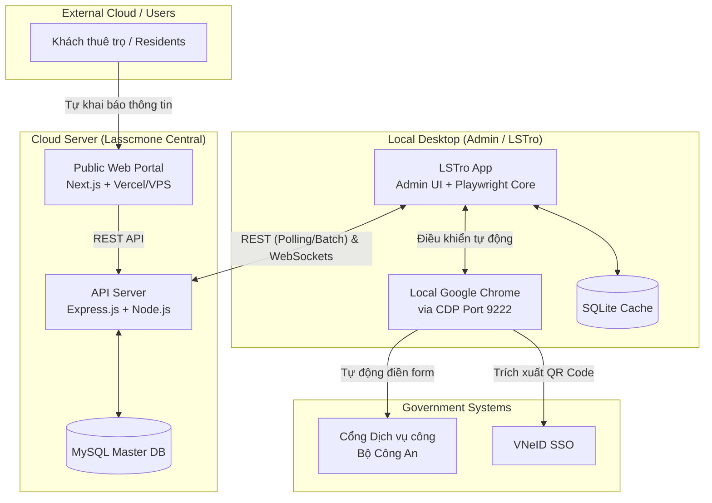

# LSTro Ecosystem - Hệ Sinh Thái Tự Động Hóa Dịch Vụ Công

**LSTro** là một hệ sinh thái phần mềm toàn diện (Full-stack Ecosystem) được thiết kế đặc biệt để số hóa và tự động hóa quy trình quản lý cư dân, khai báo lưu trú trên cổng Dịch vụ công Quốc gia.Hệ thống kết hợp sức mạnh của một Cổng thông tin đăng ký dành cho khách thuê (Web Portal) và một ứng dụng quản lý kiêm tự động hóa (Desktop Agent) để loại bỏ hoàn toàn quá trình nhập liệu thủ công.

---

## 🏗 Kiến trúc Hệ thống & Cấu trúc Dự án

Hệ thống được thiết kế theo mô hình 3 thành phần cốt lõi, tương tác với nhau như sơ đồ dưới đây:



```text
TA_system/
├── backend/            # Web API Server
├── frontend/           # Web Portal (Cổng đăng ký khách thuê / Public)
├── LSTro/              # Desktop App (Quản lý Admin & Automation Agent)
├── ARCHITECTURE.md     # Tài liệu kiến trúc hệ thống chi tiết
└── cv.md               # Tài liệu mô tả dự án và tính năng chuyên sâu
```

1. **`frontend/` (Public Portal)**
   - Ứng dụng web dành cho người dùng cuối (khách thuê), xây dựng bằng **Next.js 16** (React 19) và **Tailwind CSS 4**.
   - Chức năng: Cung cấp biểu mẫu trực tuyến để khách thuê tự khai báo thông tin nhập trọ, trả phòng. Dữ liệu được gửi trực tiếp về Backend.

2. **`backend/` (API & Database)**
   - API Server xây dựng bằng **Node.js/Express.js**, quản lý dữ liệu qua **Prisma ORM** và **MySQL**.
   - Chức năng: Lưu trữ, xử lý logic, đồng bộ dữ liệu giữa các nhánh/cơ sở và Web Dashboard.

3. **`LSTro/` (Admin Dashboard & Automation Agent)**
   - Ứng dụng Quản lý Desktop dùng **Electron.js** đóng vai trò là Dashboard chính cho Admin.
   - Chức năng tự động hóa: Sử dụng **Playwright** chạy qua cổng **Chrome DevTools Protocol (CDP)** để "ký sinh" vào trình duyệt thật, nhận danh sách thực thi, và thay thế con người thực hiện các tác vụ trên trang Dịch vụ công.

---

## ✨ Các Tính Năng Nổi Bật

- **Tự động hóa trình duyệt (Human-like Automation):** Vượt qua các cơ chế chống bot nhờ chạy qua CDP, tự động điền form, xử lý các giao diện web phức tạp của Cổng dịch vụ công như Select2, jQuery dropdown.
- **Tích hợp SSO VNeID:** Tự động phát hiện, trích xuất và stream mã QR đăng nhập từ trang Chính phủ về Web Dashboard qua WebSocket để quét bằng điện thoại dễ dàng.
- **Micro-step Logging & Real-time Tracking:** Giám sát trạng thái tự động hóa theo thời gian thực nhờ kết nối WebSocket. Dữ liệu thành công/thất bại từng bước được cập nhật lập tức trên màn hình Admin ở Desktop App.
- **Bảo toàn dữ liệu (Data Integrity):** Cơ chế hàng đợi (queue) thông minh giúp tạm dừng, tiếp tục xử lý (retry/abort) nhiều hồ sơ cùng lúc, đồng thời đồng bộ giữa SQLite ngầm (Local) và MySQL (Server).

---

## 💻 Tech Stack

- **Frontend:** React 19, Next.js 16, Tailwind CSS 4, Lucide Icons.
- **Backend:** Node.js, Express.js, Prisma ORM.
- **Database:** MySQL (Central System), SQLite (Agent Cache/Local).
- **Desktop & Automation:** Electron.js, Playwright, Chrome DevTools Protocol (CDP).
- **Communication:** WebSockets (ws), RESTful APIs.

---

## 🚀 Hướng Dẫn Cài Đặt (Quick Start)

### 1. Yêu cầu trước khi cài đặt (Prerequisites)
- [Node.js](https://nodejs.org/) (Khuyến nghị bản v18 trở lên)
- [MySQL](https://dev.mysql.com/downloads/installer/) Server
- Trình duyệt Google Chrome (Dành cho LSTro Desktop Agent)

### 2. Thiết lập & Chạy Backend (`/backend`)
```bash
cd backend
npm install
# Cấu hình biến môi trường (Database, Port...) trong file .env
npx prisma generate
npx prisma db push  # Hoặc prisma migrate dev
npm run dev
```

### 3. Thiết lập & Chạy Frontend (`/frontend`)
```bash
cd frontend
npm install
# Cấu hình biến môi trường (API URL...) trong file .env.local
npm run dev
```

### 4. Thiết lập & Chạy Desktop Agent (`/LSTro`)
Lưu ý: Bạn cần cấp quyền mở Chrome DevTools Debugging Port (mặc định Port 9222).
```bash
cd LSTro
npm install
npm start
```

---

## 📖 Tài Liệu Tham Khảo Thêm
- Vui lòng xem [ARCHITECTURE.md](./ARCHITECTURE.md) để hiểu sâu hơn về kiến trúc trao đổi API/WebSocket và luồng xử lý (Registration Flow).
- Đọc [cv.md](./cv.md) để đánh giá các giải pháp kỹ thuật cụ thể đã giải quyết trong quá trình phát triển (UI/UX, Workflow modernization, Anti-bot bypass).
