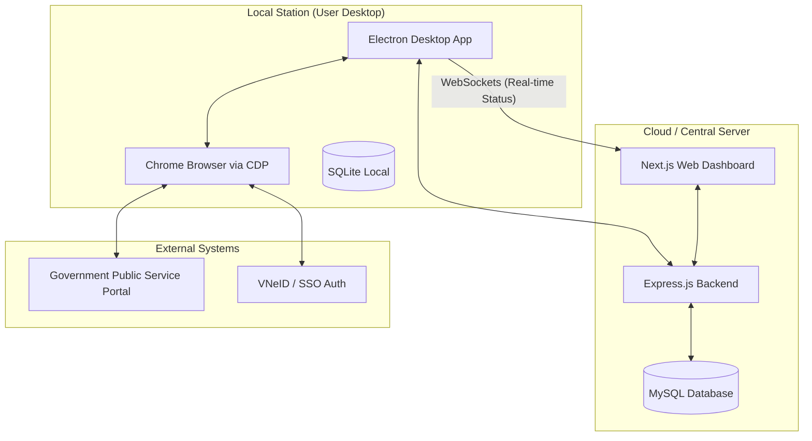

# System Architecture - LSTro Ecosystem

This document describes the high-level architecture of the LSTro system, a multi-layered platform designed to automate residency registration processes.

## 🏗 High-Level Architecture

The system consists of three main components interacting in a distributed environment:



---

## 💻 Component Breakdown

### 1. Centralized Management (Web Dashboard)
Located in the `/frontend` and `/backend` directories.
-   **Frontend**: Built with **Next.js 16 (React 19)**, **TypeScript**, and **Tailwind CSS 4**. It serves as the primary interface for administrators to manage residents, branches, and monitor overall system health.
-   **Backend**: A **Node.js/Express** server that exposes a RESTful API.
-   **ORM**: **Prisma** is used for type-safe database access to a **MySQL** database.
-   **Responsibility**: Data persistence, business logic, and cross-branch data aggregation.

### 2. Automation Agent (LSTro Desktop)
Located in the `/LSTro` directory.
-   **Core**: **Electron.js** application.
-   **Automation Engine**: **Playwright** connected via **Chrome DevTools Protocol (CDP)**.
-   **Local Server**: A lightweight Express/WebSocket server running inside the Electron process to handle bridge communication.
-   **Responsibility**: 
    -   Connects to standard local Google Chrome instances.
    -   Extracts login QR codes from Government portals and relays them to the UI.
    -   Automates form-filling tasks with human-like interactions.

### 3. Data Flow & Communication
-   **REST API**: The primary method for the Agent to fetch resident data from the Central Server.
-   **WebSockets (WS)**: Used for bi-directional, low-latency communication between the Automation Engine and the User Interface. 
    -   *Flow*: Processing Status -> Agent -> WebSocket -> Frontend Dashboard.
-   **CDP (Chrome DevTools Port 9222)**: Allows the Playwright engine to attach to a real browser session, bypassing many anti-bot measures found in headless browsers.

---

## 🛠 Technology Stack

| Layer | Technologies |
| :--- | :--- |
| **Frontend** | React 19, Next.js 16, Tailwind CSS 4, Lucide Icons |
| **Backend** | Node.js, Express.js, Prisma ORM |
| **Database** | MySQL (Central), SQLite (Local/Cache) |
| **Automation** | Playwright, Chrome DevTools Protocol (CDP) |
| **Desktop** | Electron.js |
| **Real-time** | WebSockets (ws library) |

---

## 🔄 Interaction Sequence (Registration Flow)

1.  **Selection**: User selects residents on the **Next.js Dashboard**.
2.  **Request**: Dashboard sends a batch of tasks to the **Automation Agent** via WebSocket/HTTP.
3.  **Connection**: Agent attaches to **Chrome** and checks for an active session on the Gov portal.
4.  **Auth (if needed)**: Agent trích xuất QR code -> User scans via VNeID app -> Session activated.
5.  **Execution**: Agent iterates through the resident queue:
    -   Navigates to "Thủ tục thông báo lưu trú".
    -   Fills detailed fields (CCCD, Name, Location, etc.) using `Playwright` locator strategies.
    -   Clicks "Submit".
6.  **Feedback**: Each step's success/failure is broadcasted back to the **Web Dashboard** for real-time monitoring.

---

## 📂 Project Structure

```text
TA_system/
├── backend/            # Express.js + Prisma (MySQL) API
├── frontend/           # Next.js 16 + Tailwind 4 Management UI
├── LSTro/              # Electron + Playwright Automation Agent
│   ├── src/
│   │   ├── main.js         # Electron entry point (CDP Manager)
│   │   ├── automation.js   # Playwright-based automation engine
│   │   └── renderer/       # Local monitoring UI
└── ARCHITECTURE.md     # System documentation
```
