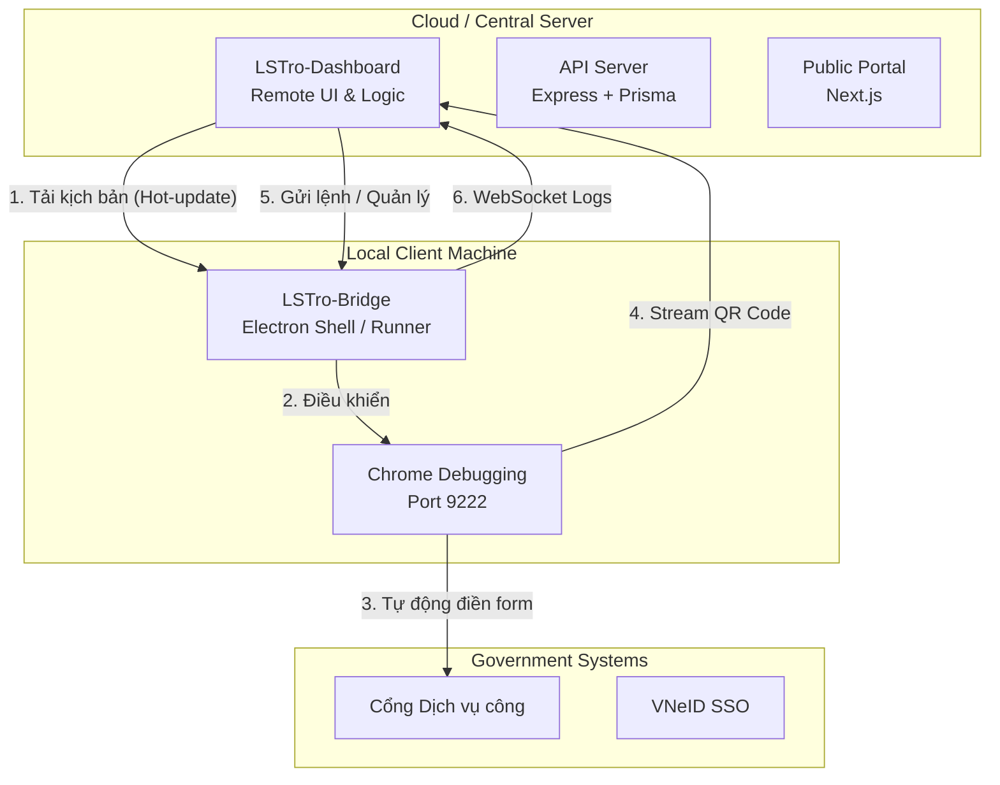

# LSTro Ecosystem - Hệ Sinh Thái Tự Động Hóa Dịch Vụ Công (v2.0)

**LSTro** là một hệ sinh thái phần mềm Full-stack hiện đại, được thiết kế để số hóa và tự động hóa 100% quy trình quản lý cư dân và khai báo lưu trú trên cổng Dịch vụ công Quốc gia. Phiên bản 2.0 chuyển đổi sang kiến trúc **"Remote Brain"**, cho phép cập nhật tính năng và kịch bản tự động hóa từ xa mà không cần cài đặt lại phần mềm.

---

## 🏗 Kiến trúc Hệ thống mới (Remote Brain)

Hệ thống được module hóa hoàn toàn để tối ưu khả năng bảo trì và mở rộng:



---

## 📂 Cấu trúc Thư mục Dự án

- **`backend/`**: Máy chủ API trung tâm xử lý dữ liệu cư dân và chi nhánh (Node.js/Prisma/MySQL).
- **`frontend/`**: Cổng thông tin dành cho khách thuê tự đăng ký thông tin (Next.js/Tailwind).
- **`LSTro-Dashboard/`**: **[QUAN TRỌNG]** Chứa toàn bộ giao diện quản trị và kịch bản Automation (Javascript). Đây là nơi bạn sửa đổi tính năng mà không cần build lại app.
- **`LSTro-Bridge/`**: Ứng dụng Electron đóng vai trò "vỏ bọc" thực thi local, kết nối với Chrome qua giao thức CDP.

---

## ✨ Tính năng Nổi bật v2.0

- **Kiến trúc Zero-Logic Bridge:** Bridge chỉ là lớp vỏ, toàn bộ "bộ não" automation được tải từ xa từ Dashboard. Cho phép vá lỗi và thêm tính năng chỉ trong 1 giây.
- **WebSocket Real-time Logs:** Theo dõi từng bước chạy của bot (Human-like movements) ngay trên giao diện Web Dashboard với phản hồi độ trễ cực thấp.
- **Đồng bộ hóa 1-Click:** Tính năng Sync giúp kéo toàn bộ danh sách cư dân mới từ Backend về hàng chờ thực thi của Bridge chỉ với một nút bấm.
- **Hỗ trợ F5 & DevTools:** Bridge hỗ trợ phím tắt F5 để làm mới giao diện từ xa và F12 để gỡ lỗi nhanh.
- **Bảo mật AES-256:** Kết nối mã hóa giúp bảo vệ thông tin khi truyền tải giữa Dashboard và Bridge.

---

## 🚀 Hướng Dẫn Khởi Chạy

### 1. Chạy mã nguồn Dashboard (Phía Server)
Đảm bảo bạn đã bật Live Server hoặc hosting cho thư mục Dashboard:
```bash
# Địa chỉ mặc định dự kiến
http://127.0.0.1:5500/LSTro-Dashboard/index.html
```

### 2. Chạy ứng dụng Bridge (Phía máy tính thực thi)
Yêu cầu máy tính đã cài Google Chrome.
```bash
cd LSTro-Bridge
npm install
npm start
```

---

## 🛠 Quy trình Bảo trì & Cập nhật

- **Sửa Bug Automation:** Chỉnh sửa file `LSTro-Dashboard/js/automation.js`. Tất cả các máy khách đang dùng Bridge sẽ tự nhận bản sửa lỗi khi reload trang.
- **Thêm tính năng UI:** Chỉnh sửa file `index.html` hoặc `js/ui.js` tại thư mục Dashboard.
- **Sửa lỗi hệ thống (Cửa sổ ứng dụng):** Chỉ khi cần can thiệp sâu vào phím tắt hoặc quyền truy cập file mới cần chỉnh sửa `LSTro-Bridge/main.js`.

---
*Phát triển bởi Lasscmone Studio. Bản quyền thuộc về dự án LSTro 2024.*
